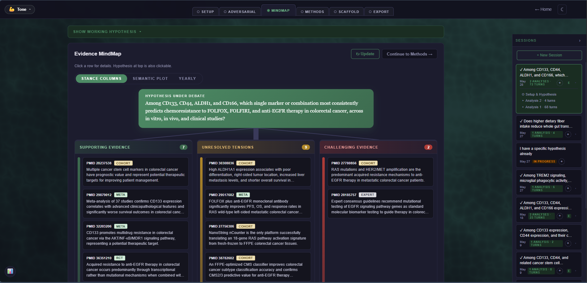
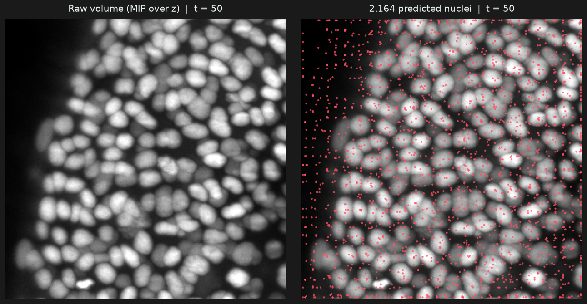
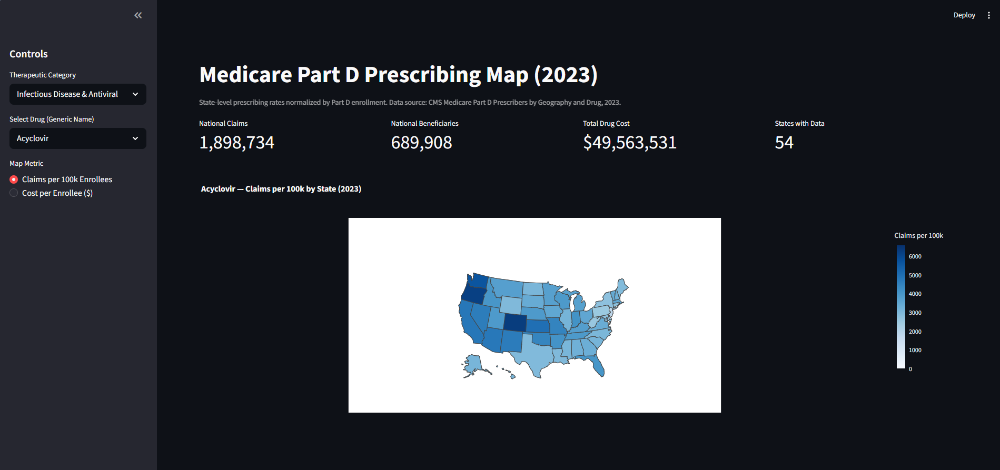
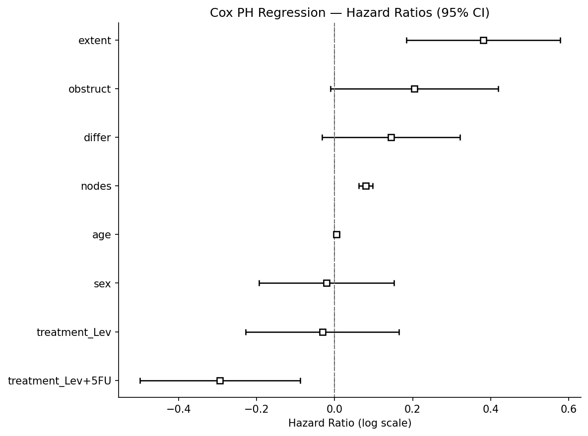

<h1 align="center">Preston Laney</h1>
<h3 align="center">Biomedical scientist building end-to-end ML + data engineering for oncology and clinical research</h3>

<p align="center">
  <a href="https://colo-sci.com/portfolio"></a>
  <a href="https://linkedin.com/in/preston-laney-1465b598"></a>
</p>

---

### About

MS Biomedical Science (Wake Forest University School of Medicine), BS Biochemistry (Arizona State University), three peer-reviewed oncology publications, and bench experience across patient-derived 3D tumor organoids, HIPEC perfusion modeling, immunotherapy efficacy testing, and building an analytical laboratory from scratch. Working across the software-engineering and data-science side of biomedical research: pharmacovigilance and real-world evidence (FDA FAERS, MedDRA coding, disproportionality analysis), geographic disease surveillance on CMS Medicare data, survival analysis (Kaplan-Meier + Cox proportional hazards), retrieval-augmented literature synthesis with multi-agent LLM systems, 3D microscopy detection and tracking with deep learning, and target-agnostic ML for drug discovery. Fluent at both benches, the lab and the terminal.

---

### Featured work

<table>
  <tr>
    <td width="50%" valign="top">
      <a href="https://github.com/PugstaLaney/Colo">
        
      </a>
      <p><strong><a href="https://colo-sci.com">Colo</a></strong>, production multi-agent literature synthesis workspace<br>
      <sub>Two-agent adversarial debate over 3.4M+ indexed biomedical abstracts, evidence mindmap with citation-network overlays, methods scaffold generator. Python + FastAPI + ChromaDB + Anthropic Claude + Supabase + Stripe.</sub></p>
    </td>
    <td width="50%" valign="top">
      <a href="https://github.com/PugstaLaney/Biohub-Zebrafish-Embryo-Prediction---Kaggle">
        
      </a>
      <p><strong><a href="https://github.com/PugstaLaney/Biohub-Zebrafish-Embryo-Prediction---Kaggle">Biohub Zebrafish Cell Tracking (Kaggle)</a></strong><br>
      <sub>3D anisotropic DynUNet detector + Hungarian linker + three-check division rescue on 4D light-sheet microscopy. Trained locally on RTX 3060; end-to-end pipeline from raw zarr volumes through sliding-window inference and cross-timepoint linking to Kaggle-format tracking graphs.</sub></p>
    </td>
  </tr>
  <tr>
    <td width="50%" valign="top">
      <a href="https://github.com/PugstaLaney/Medicare-Prescriptions-Geography-Application">
        
      </a>
      <p><strong><a href="https://medicare-prescriptions-geography-application.streamlit.app">Medicare Part D Geographic Surveillance</a></strong><br>
      <sub>Interactive Streamlit app for state-level per-capita Medicare Part D prescribing analysis. Choropleth by drug + rankings; SQL over the full CMS geography dataset.</sub></p>
    </td>
    <td width="50%" valign="top">
      <a href="#">
        
      </a>
      <p><strong>SEER CRC Survival Analysis (Phase 1)</strong><br>
      <sub>Kaplan-Meier + Cox proportional hazards modeling of colorectal cancer survival on the NCCTG cohort. Multivariate adjustment, log-rank testing, Schoenfeld residual verification. Phase 2 (SEER DUA) in progress.</sub></p>
    </td>
  </tr>
</table>

---

### Peer-reviewed publications (3)

- **Cisplatin exhibits superiority over MMC as a perfusion agent in a peritoneal mesothelioma patient-specific organoid HIPEC platform.** *Scientific Reports*, July 2023 · [8 citations]
- **Application of immune-enhanced organoids in modeling personalized Merkel cell carcinoma research.** *Scientific Reports*, August 2022 · [22 citations]
- **Organoid Platform in Preclinical Investigation of Personalized Immunotherapy Efficacy in Appendiceal Cancer: Feasibility Study.** *Clinical Cancer Research*, July 2021 · [74 citations]

Plus four conference papers at AACR Annual Meetings 2021–2023. Full list in the [portfolio](https://colo-sci.com/portfolio).

---

### Tech stack

<p>
  
  
  
  
  
  
  
  
  
  
  
  
  
</p>

---

### A design choice I care about

An anisotropic 3D U-Net stride pattern for detecting nuclei in light-sheet microscopy where voxels are 4× coarser in z than xy:

```python
# Downsample xy TWICE before touching z, so the bottleneck
# lives in physical space rather than voxel space.
kernels = [(1,3,3), (3,3,3), (3,3,3), (3,3,3), (3,3,3)]
strides = [(1,1,1), (1,2,2), (1,2,2), (2,2,2), (2,2,2)]

model = DynUNet(
    spatial_dims=3, in_channels=1, out_channels=1,
    kernel_size=kernels, strides=strides,
    upsample_kernel_size=strides[1:],
    filters=[16, 32, 64, 128, 128],
    norm_name='INSTANCE',        # NEVER BatchNorm with batch=2 in 3D
    deep_supervision=True,       # aux heads at 1/2 and 1/4 resolution
    deep_supr_num=2,
    res_block=True,
)
```

At batch size 2, batch-normalization statistics are pure noise, so InstanceNorm across the board. Deep supervision fires coarse-scale heads with useful gradients from step 1, so the model doesn't spend the first thousand steps flailing on sparsely-labeled 3D targets. Details in [the Biohub repo](https://github.com/PugstaLaney/Biohub-Zebrafish-Embryo-Prediction---Kaggle).

---

### GitHub

<p align="left">
  
  
</p>

---

<p align="center"><sub><a href="https://colo-sci.com/portfolio">Full portfolio</a> · <a href="https://linkedin.com/in/preston-laney-1465b598">LinkedIn</a></sub></p>
